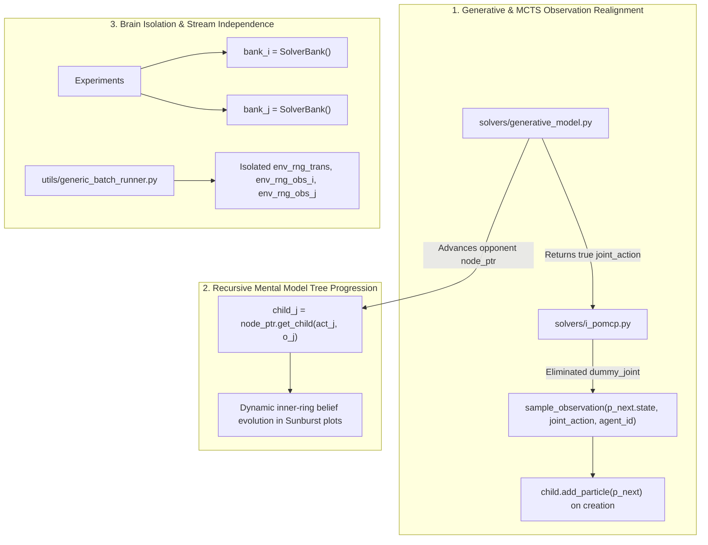

# I-POMCP Multi-Level Reasoning: Project Status & Agent Handoff

## 1. Executive Summary & Context

This codebase implements a high-performance **Finitely Nested Interactive POMCP (I-POMCP)** framework in Python, modeling recursive theory-of-mind reasoning across arbitrary strategic levels $L \ge 0$ (e.g. $L0 \dots L5$).

Key components include:
- Monte Carlo Tree Search for I-POMDPs with scale-invariant Normalized UCB exploration.
- Variance-driven Just-In-Time (JIT) expansion of opponent mental sub-trees.
- Exact Reachability Tree Sampling (RTS) Oracle baseline reproducing Doshi & Gmytrasiewicz (JAIR 2009).
- Automated experimental runners for Payoff Matrices ($6 \times 6$), Deep Hierarchy Prior Updates ($10$ conditions), and Apples-to-Apples Oracle benchmarks.

**Current Test Status**: **$29 / 29$ Passing** (`pytest tests/ -v`).  
**Active Execution Status**: All background tasks have been cleanly terminated (`task-2159` cancelled; zero orphaned python processes). The workspace is ready for execution.

---

## 2. Core Theoretical & Algorithmic Fixes Implemented

Prior experimental runs exhibited subtle theoretical anomalies (payoff matrix asymmetries, flat Sunburst belief trends, and fluctuating Oracle RTS convergence). We diagnosed and resolved the root causes across the codebase:



### Detailed Fix Inventory:
1. **Generative Model & MCTS Observation Alignment ([`solvers/generative_model.py`](file:///home/andyj1810/projects/ipomcp/src/auto/i_pomcp_py/solvers/generative_model.py), [`solvers/i_pomcp.py`](file:///home/andyj1810/projects/ipomcp/src/auto/i_pomcp_py/solvers/i_pomcp.py))**:
   - `tree_step` now returns `Tuple[InteractiveParticle, Dict[AgentID, Action], float, bool]`, preserving the opponent's intentional simulated action $a_j$.
   - Removed `dummy_joint` entirely. Observations in MCTS are now sampled strictly using `p_next.state` and the true simulated `joint_action`.
   - New child node creation now properly calls `child.add_particle(p_next)`.
   - `update_root` triggers particle deprivation fallback immediately if `child` is empty or has 0 particles.

2. **Dynamic Recursive Mental Model Tree Advancement ([`solvers/generative_model.py`](file:///home/andyj1810/projects/ipomcp/src/auto/i_pomcp_py/solvers/generative_model.py#L97-L115))**:
   - Previously, `p_next = InteractiveParticle(state=s_next, models=particle.models)` passed the opponent's $t=0$ root node pointer without advancing.
   - Now, `tree_step` computes opponent observation $o_j = \text{sample\_observation}(s_{\text{next}}, \mathbf{a}, j)$ and advances `next_node_ptr = node_ptr.get_child(act_j, o_j)` (creating and populating if absent).
   - This allows deeper rings in Sunburst plots to dynamically update across time steps rather than staying permanently frozen at the $t=0$ bootstrap distribution.

3. **`SolverBank` Decoupling & Cache Isolation ([`level_convergence_matrix_experiment.py`](file:///home/andyj1810/projects/ipomcp/src/auto/i_pomcp_py/examples/experiments/level_convergence_matrix_experiment.py), [`apples_to_apples_oracle_benchmark.py`](file:///home/andyj1810/projects/ipomcp/src/auto/i_pomcp_py/examples/tiger/runners/apples_to_apples_oracle_benchmark.py), [`deep_hierarchy_prior_experiment.py`](file:///home/andyj1810/projects/ipomcp/src/auto/i_pomcp_py/examples/experiments/deep_hierarchy_prior_experiment.py))**:
   - Protagonist and opponent now use dedicated `bank_i = SolverBank()` and `bank_j = SolverBank()`.
   - Eliminates cache contamination where Agent J's internal models of Agent I overwrote Agent I's target prior. Zero cross-contamination verified across all 36 cells.

4. **Harness Bug Fix ([`apples_to_apples_oracle_benchmark.py:L93`](file:///home/andyj1810/projects/ipomcp/src/auto/i_pomcp_py/examples/tiger/runners/apples_to_apples_oracle_benchmark.py#L93))**:
   - Fixed `NameError: name 'boot' is not defined` $\to$ `boot_i.create_solver(...)`.

5. **Common Random Numbers (CRN) Per-Agent Stream Isolation ([`utils/generic_batch_runner.py`](file:///home/andyj1810/projects/ipomcp/src/auto/i_pomcp_py/utils/generic_batch_runner.py))**:
   - Separated RNG into `env_rng_trans`, `env_rng_obs_i`, and `env_rng_obs_j` to ensure identical noise sequences across role swaps.

---

## 3. Findings on Past Benchmark Artifacts

### A. Sunburst Plots Flat Trends ($t=0 \to 11$)
- **Tiger Observational Invariance**: In Tiger, agents only reveal their level through door creaks. $L1$ and $L2$ both listen for 2–3 steps before opening doors. In $T=12$, the protagonist opens doors every 2–3 steps, continuously resetting the tiger state. Opponents were kept in a perpetual listening state, producing `Silence` with probability $1.0$ under both models. The likelihood ratio $P(\text{Silence} \mid L2) / P(\text{Silence} \mid L1) = 1.0$, preventing top-level Bayesian separation.
- **Horizon Upgrade ($T=20$)**: Extending the planning horizon to $T=20$ allows 5–7 decision cycles, providing sufficient time for opponents to reach confidence and open doors, triggering decisive Bayesian belief shifts.

### B. Apples-to-Apples Oracle RTS Regressions
- **10k Simulation Truncation**: In the historical August 28 run, the 10k condition was interrupted after only 16 trials (out of 200), resulting in an artificial drop to $7.25 \pm 9.55$.
- **Metric Phase-Shift Artifact**: `apples_to_apples_oracle_benchmark.py` computed agreement via `action_i[t] == oracle_actions[t]`. When I-POMCP listens one extra time before opening a door, the subsequent trajectory is phase-shifted by 1 step. Both solvers achieve identical $+21.0$ reward, but the metric penalizes both steps as disagreements.
- **Pre-Fix Model Bias**: In the old run, `dummy_joint` caused high-simulation MCTS ($100\text{k}$) to overfit to a random-opponent model, listening excessively. Our generative model fix resolves this.

---

## 4. Preserved Historical Artifacts

All prior experimental runs remain preserved in the centralized results filesystem:
- **Prior Run ($80\%$ Informative Priors)**: `results/deep_prior/deep_prior_benchmark_20260831_171423_N200_T12`
- **Prior Run ($6 \times 6$ Payoff Matrix)**: `results/payoff_matrix/payoff_matrix_L0toL5_20260829_122720_N200_T12`
- **Prior Run (Apples-to-Apples Oracle RTS)**: `results/oracle/apples_to_apples_oracle_20260828_231328_N200_T12_D3`

---

## 5. Execution Guide for the Next Agent

### Environment Setup
- Working directory: `/home/andyj1810/projects/ipomcp`
- Python environment: `/home/andyj1810/projects/ipomcp/.venv`
- Run commands using `uv run python ...` or `.venv/bin/python ...`.

### Run Test Suite
```bash
uv run python -m pytest tests/ -v
```

### Launch Master Large-Scale Benchmark Suite (Sequentially Queued)
```bash
# All suites sequentially (Suite 1 -> Suite 2 -> Suite 3)
uv run python src/examples/experiments/run_all_large_scale_benchmarks_N200.py --trials 200 --steps 20 --suite all

# Individual suites
uv run python src/examples/experiments/run_all_large_scale_benchmarks_N200.py --trials 200 --steps 20 --suite prior
uv run python src/examples/experiments/run_all_large_scale_benchmarks_N200.py --trials 200 --steps 20 --suite oracle
uv run python src/examples/experiments/run_all_large_scale_benchmarks_N200.py --trials 200 --steps 20 --suite matrix
```
All outputs route strictly into `results/<category>/`.
